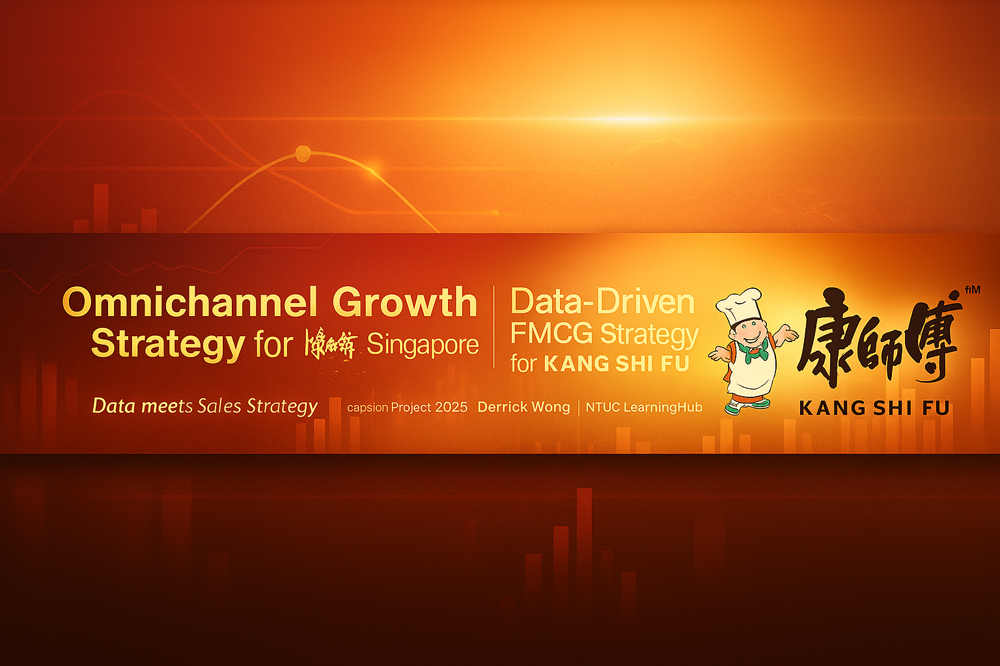
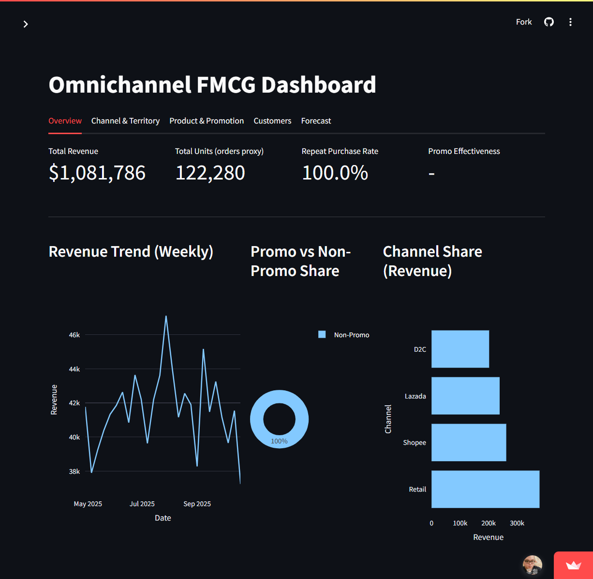

# 🏗️ Building the Omnichannel Growth Engine  
**Data-Driven Sales Acceleration for 康师傅 Singapore (Mock FMCG Capstone Project)**  
Prepared by **Derrick Wong** | Graduate, NTUC LearningHub Associate Data Analyst Course (Cohort 36, 2025)


---



---
## 🌐 Live Demo

[](https://omnichannel-growth-engine-b3mqptt73h9dbe4scq4akd.streamlit.app/)

> Click the badge to launch the live interactive dashboard hosted on Streamlit Cloud.
---

## 🧭 Problem Statement
In Singapore's FMCG market, retail and online channels operate in silos.  
This project demonstrates how **康师傅 Singapore** can use omnichannel analytics to optimise promotions, forecasting, and channel strategy — using **100% synthetic data**.

---

## 🚀 Executive Summary
This project showcases an end‑to‑end analytics engine including:
- Data cleaning  
- Exploratory analysis  
- Predictive modelling  
- BI‑style dashboard  
- Business storytelling  

All datasets are synthetic and PDPA‑safe.

---

## 🎯 Objectives
- Build a structured **data pipeline**  
- Diagnose **channel, territory, and category** performance  
- Forecast future sales  
- Analyse customers & promotions  
- Deliver a **Streamlit dashboard**  

---

## 🧩 Project Architecture
```
omnichannel-growth-engine/
├── data/
├── clean/
├── notebooks/
├── presentation/
├── app/
├── README.md
└── requirements.txt
```

---

## 📊 Notebook Breakdown

| Notebook | Purpose |
|---------|---------|
| 01_data_cleaning.ipynb | Cleaning, type fixing, deduping |
| 02_exploratory_analysis.ipynb | KPIs, trends, promo uplift |
| 03_predictive_models.ipynb | Forecasting, clustering, promo prediction |
| 04_visualization_dashboard.ipynb | Dashboard prototype |

---

## 💻 Tech Stack  
Python • Pandas • NumPy • Plotly • Streamlit • Scikit‑Learn • Prophet/ARIMA

---

## 📊 Dashboard Preview  


---

# 🔒 PDPA Compliance

This project complies fully with Singapore’s **PDPA**.  
All data used is:

- **100% synthetic**  
- **Artificially generated for educational use**  
- **Not linked to any real customer or internal business data**

### ✔ No personal data  
No NRIC, phone, email, address, or identifiable behaviour used.

### ✔ No confidential business data  
All values simulate realistic FMCG behaviour but remain fabricated.

### ✔ Intended purpose  
Education, portfolio building, and analytics demonstration only.

### ✔ Intellectual Property  
Brand names remain the property of their respective owners.

---

<details>
<summary><strong>🔒 PDPA (Collapsible Version)</strong></summary>

All datasets are synthetic and anonymised. No personal or confidential data is processed.

</details>

---

## 🧾 Author  
**Derrick Wong**  
Graduate, NTUC LearningHub (ADA Cohort 36)  
📍 Singapore  
📧 huang.derrick@gmail.com  
🔗 LinkedIn: https://www.linkedin.com/in/daddylaughing
